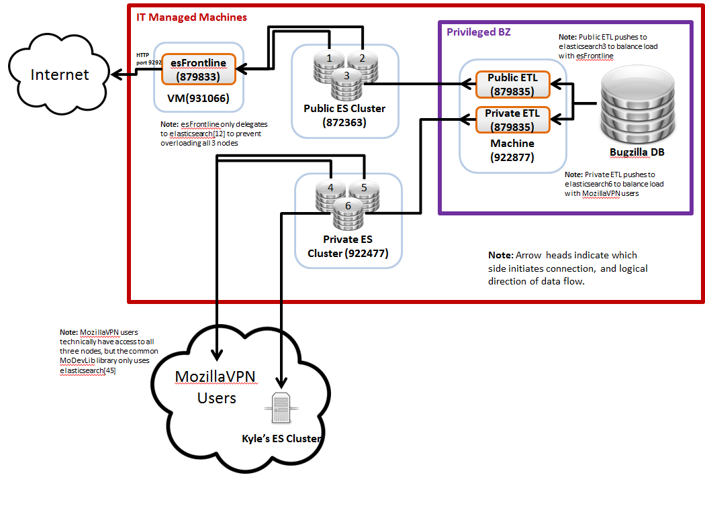

# 2018 Q1 Overview and Upgrade Plan

What follows is the general high-level architecture of all the important parts, how it will be changing in the context of the Bugzilla cluster, and where help would be appreciated.

## Overview 

[

### Public and Private Clusters [[wiki](https://wiki.mozilla.org/BMO/ElasticSearch)]

ElasticSearch is being used as a data warehouse, and is storing bug snapshots for every bug, every change, every annotation, and every comment. As an example, [here are the snapshots for one bug](https://charts.mozilla.org/metrics/Tutorial01-Minimum.html). Each snapshot is a JSON document representing the state of the bug between the `modified_ts` and `expires_on` timestamps.

This cluster is very fast. You can get information on tens of thousands of bugs from a single request, and in seconds. Even if you do not drive dashboards off of it directly, you can use it as a datasource; it is much faster to get the bug data you need from ES than from Bugzilla. 

#### Action Required (mostly OPS)

1. Setup ES6 cluster (or service) - no data migration is required since the ETL transformation code was designed to handle ES instability, and it will autofill missing bugs (at about 200 kilobugs per hour, newest bugs first).
2. Teardown old cluster when done

### ETL Pipeline [[code](https://github.com/klahnakoski/Bugzilla-ETL)] [[bugs](https://bugzilla.mozilla.org/showdependencytree.cgi?id=959670&hide_resolved=1)]

The ETL pipeline is scheduled to run every 10 minutes, scan the Bugzilla database for all changes since last scan, and update the cluster. The code has some known bugs (listed [on Bugzilla](https://bugzilla.mozilla.org/showdependencytree.cgi?id=959670&hide_resolved=1) not on Github), but they have not been a priority for years. 

#### Action Required (in Python)

1. Fix inconsistency bug - The ETL sometimes corrupts the snapshots due to a parallelism bug: [https://bugzilla.mozilla.org/show_bug.cgi?id=1063125](https://bugzilla.mozilla.org/show_bug.cgi?id=1063125) making the snapshots inconsistent (overlapping time intervals). This turns out to not be a big issue as the corruption is fixed the next time the bug is changed, leaving very few inconsistent snapshots. 
  * This may already be written, but not tested, in the `v2` branch
2. Add the Typed Encoder - The new version of Elasticsearch is more like a pedantic database than a flexible data lake; we must use the [Typed Encoder](https://github.com/klahnakoski/mo-json/blob/master/mo_json/typed_encoder.py) to transform the JSON documents. The format allows us to automate the schema management, as Bugzilla schema inevitably changes over the years.
  * Jan8 - Looks like the typed encoder must be enhanced to handle [Elasticsearch multifields](https://www.elastic.co/guide/en/elasticsearch/reference/current/multi-fields.html)
3. Optional - Upgrade the `pyLibrary` - This is copy of my old pyLibrary, which has split into multiple packages, and made to work with Python3. The ETL code should be upgraded to use these new libs; which must also be vendorded into the repo so there are no pip dependencies (except maybe `requests`). 
4. Optional - Upgrade to Python 3 - Since this program will not be touched again in many years, it may be a good time to get it to work on Python3.

Deploying will take time because the production code runs on servers we can not access. OPS will be involved as inevitable production bugs appear.

### esFrontline [[code](https://github.com/klahnakoski/esFrontLine)]

esFrontline is a very basic proxy server for the public cluster that limits http requests to just query requests. This will be replaced by an [ActiveData](https://github.com/klahnakoski/ActiveData) instance.

#### Action Required

* Remove (mostly OPS)

### MoDevMetrics [[code](https://github.com/klahnakoski/MoDevMetrics)]

MoDevMetrics is a collection of javascript libraries and helper methods to write dashboards using the ES clusters directly. With this collection, dashboards are usually one page of HTML, queries, and javascript. Queries are in a special format called [JSON Query Expressions](https://github.com/klahnakoski/ActiveData/blob/dev/docs/jx.md), which are succinctly described as "SQL parse trees in JSON".

The MoDevMetrics has a few main parts

* **The ES query translator** - ES does not have a SQL interface, it was not designed for data warehouse queries. As such, all queries are translated to ElasticSearch queries. This translation is quite complex since ESv0.9 had limited query ability.
* **Internal Query Runner** - Accepts queries and operates on data locally. Since I come from a database background, I find expressing data transformation as queries more clear than using javascript. 
* **Charting libraries** - Since every charting library has some lethal deficiency, I made a common API to a couple charting of libraries. 
* **Dimension Definitions** - Maps business concepts like "open bug" or "current bug state" into filters required to extract that, which at times gets complicated. 

#### Action Required (in Javascript)

1. Remove the javascript ES query translator code so that queries are sent directly to ActiveData, and existing dashboards still work with the new architecture. This can only be done after we have a prototype for the new Bugzilla-ETL, and a (dev) cluster exists to test with.
2. Work with `armenzg` and `wlach` to identify any common ground when it comes to charting libraries and  resources in the dashboarding space.
3. Optional - Add testing to the internal query runner. There are currently no tests for this code, but there is a comprehensive Python test suite. There should be a simple solution here.
4. Optional - Use the React/JSX stack. A good part of MoDevMetrics can be removed if it gets moved to a React app. plus, it will make everything faster.

## Other parts

### ActiveData [[code](https://github.com/klahnakoski/ActiveData)] [[wiki](https://wiki.mozilla.org/EngineeringProductivity/Projects/ActiveData)]

ActiveData is near-stateless web service that wraps an ES cluster to make it behave as a simple data warehouse. Most importantly, it translates [JSON Query Expressions](https://github.com/klahnakoski/ActiveData/blob/dev/docs/jx.md) into ES queries.

An ActiveData instance will replace the esFrontLine in front of the public cluster. Another instance will be put in front of the private cluster, behind the VPN.  

#### Action Required (mostly OPS)

1. Setup front ends for the private and public clusters.  

### Metrics Graphics [[code](https://github.com/mozilla/metrics-graphics)] [[docs](https://www.metricsgraphicsjs.org/)]

This is one of the charting libraries used by MoDevMetrics.  A `armenzg` is interested in dashboarding and has expressed interest in upgrading it so it can be easily used in JSX/React apps.   

 

